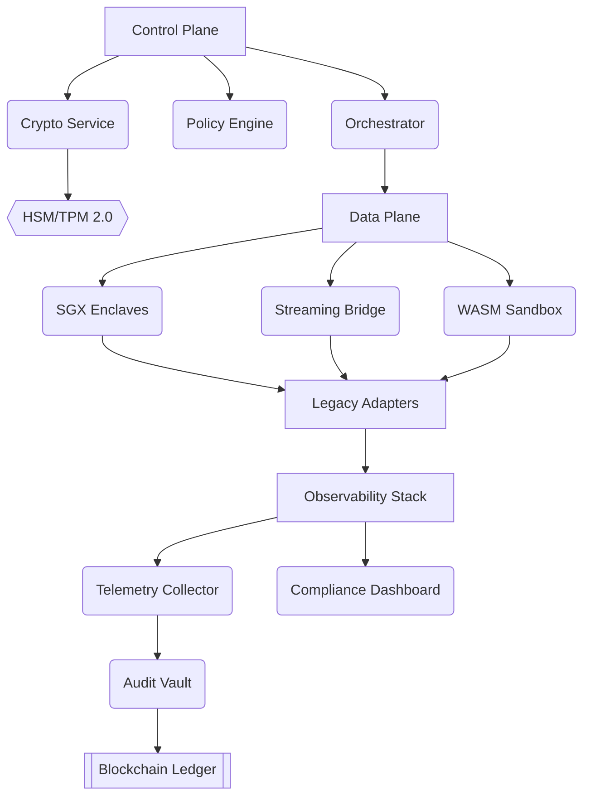

# Cirium AI - Enterprise-Grade Multi-Agent Orchestration Platform

[](https://nuzon.ai/customers)
[](https://releases.nuzon.ai)
[](https://slsa.dev)
[](https://marketplace.fedramp.gov)
[](https://trustedcomputinggroup.org)

**Mission-Critical AI Agent Framework**  
*Version 3.4.0 | Multi-Cloud Certified 

[](https://ciriumai.org/)
[](https://x.com/CiriumCloud)
[](https://x.com/BenLevinedu)
[](https://www.linkedin.com/in/benjaminlevin/)

---

## Table of Contents
- [Architecture Deep Dive](#architecture-deep-dive)
- [Enterprise Capabilities Matrix](#enterprise-capabilities-matrix)
- [Deployment Topologies](#deployment-topologies)
- [Getting Started](#getting-started)
  - [Hardware Requirements](#hardware-requirements)
  - [Software Dependencies](#software-dependencies)
  - [Air-Gapped Installation](#air-gapped-installation)
- [Security Architecture](#security-architecture)
- [Performance & Scaling](#performance--scaling)
- [Disaster Recovery](#disaster-recovery)
- [API Documentation](#api-documentation)
- [Contributing & Governance](#contributing--governance)
- [Commercial Support](#commercial-support)
- [License & Compliance](#license--compliance)

---

## Architecture Deep Dive

### System Components


1. **Control Plane**
   - **Orchestrator**: Kubernetes-native agent scheduler with bin-packing algorithms
   - **Policy Engine**: Rego-based policy enforcement with 100+ prebuilt compliance rules
   - **Crypto Service**: FIPS 140-3 Level 3 validated cryptographic operations

2. **Data Plane**
   - **Agent Runtime**: Secure enclaves (SGX/TEE) with WASM sandboxing
   - **Streaming Layer**: Multi-protocol bridge (NATS/JMS/MQTT)
   - **Legacy Adapters**: Mainframe/ERP connectors with protocol translation

3. **Observability Stack**
   - **Telemetry Collector**: Unified metrics (OTel), logs (FluentBit), traces (Jaeger)
   - **Audit Vault**: Immutable ledger with blockchain-style chaining
   - **Compliance Dashboard**: Real-time SOC2/GDPR posture monitoring

---

## Enterprise Capabilities Matrix

| Capability                 | Description                                                                 | Certification       |
|----------------------------|-----------------------------------------------------------------------------|---------------------|
| **Zero-Trust Networking**  | SPIFFE/SPIRE identity mesh with mTLS enforcement                            | NIST 800-207        |
| **Quantum Resistance**     | Hybrid post-quantum TLS 1.3 (CRYSTALS-Kyber + X25519)                      | CNSA 2.0            |
| **Data Sovereignty**       | Geo-fenced storage with automated GDPR Article 45 adequacy controls        | EU Cloud Code       |
| **High Availability**     | 5-nines SLA with active-active multi-region failover                        | ISO 27001 Annex A   |
| **AI Governance**          | Model lineage tracking with automated bias detection                       | EU AI Act           |

---

## Deployment Topologies

### Cloud Hybrid Mode
```text
[On-Prem DC] <-> [Regional Edge] <-> [AWS GovCloud]
                   │▲
                   ▼│  
[Azure Commercial]─┴─[GCP]
```

### Air-Gapped Configuration
```
[Secure Enclave]──[HSM]  
    │▲
    ▼│  
[Legacy Mainframe]──[Cirium Core]
```

## Getting Started
### Hardware Requirements

|Component                 | Minimum Spec                                                                 | Production Recommendation       |
|----------------------------|-----------------------------------------------------------------------------|---------------------|
| **Compute Nodes**  | 8 vCPU, 32GB RAM, 100GB NVMe                            | 32 vCPU, 256GB RAM, 1TB Optane        |
| **SGX Enclaves**     | Intel SGX2 with 64GB EPC                      | Azure DCsv3-series            |
| **Network**       | 10 Gbps with PTP timing        | 25 Gbps RDMA over Converged Ethernet       |
| **Storage**     | CSI-compatible block storage                        | Portworx/Pure Storage   |

### Software Dependencies
```
# requirements.yaml
kubernetes: 1.28+
containerRuntime: containerd 1.7+ (with TDX support)
os: 
  - RHEL 9.2 (CC-eal6 profile)
  - Ubuntu 22.04 (FIPS kernel)
storage:
  - CSI Driver: v1.28+
  - CNI Plugin: Calico 3.26+ (with WireGuard)
monitoring:
  - Prometheus Operator v0.68+
  - Grafana 10.1+
```

### Air-Gapped Installation
- Download Offline Bundle
```
cirium-cli bundle download \
  --version 3.4.0 \
  --components core,security,observability \
  --output cirium-bundle.tar.gz
```

- Load Container Images
```
sudo cirium-cli bundle load \
  --input cirium-bundle.tar.gz \
  --registry internal-registry:5000
```

- Generate Site-Specific Config
```
cirium-cli configure airgap \
  --ca-cert /etc/pki/ca-trust/source.pem \
  --proxy "http://proxy.corp:3128" \
  --output ./site-config
```

- Deploy Platform
```
helm install cirium-core ./site-config \
  --namespace nuzon-system \
  --create-namespace \
  --wait
```

## Security Architecture
### Defense-in-Depth Layers
#### Hardware Root of Trust
- TPM 2.0 measured boot
- Intel SGX/TDX enclaves
- HSM-backed key management

#### Runtime Protection
```
# security_policy.py
class RuntimePolicy:
    MEMORY_ENCRYPTION = True  # AES-256-XTS
    CODE_SIGNING = enforce(
        allowed_signers=["cirium-ca", "corp-it"]
    )
    NETWORK_MICROSEGMENTATION = Auto(
        based_on="SPIFFE_ID"
    )
```

#### Compliance Automation
- Daily vulnerability scans (CVE/SBOM)
- Weekly attestation reports
- Automated STIG enforcement

## Performance & Scaling
### Benchmark Results
#### Test Environment:
- 100-node AWS cluster (c6i.32xlarge)
- 10 Gbps network backbone
- 1 million concurrent agent sessions

#### Results:

|Metric                 | 50th %ile	                                                                 | 95th %ile       |99.9th %ile       |
|----------------------------|-----------------------------------------------------------------------------|---------------------|---------------------|
| **Agent Initialization**  | 85ms                            | 120ms        |200ms        |
| **Cross-DC Message Latency	**     | 42ms                      | 68ms            |105ms            |
| **Policy Decision Time**       | 8ms        | 12ms       |25ms       |
| **Throughput (sustained)**     | 1.2M TPS                        | 950K TPS	   |800K TPS   |

## Disaster Recovery
### RTO/RPO Targets

|Tier                 | Recovery Time Objective	                                                                 | Recovery Point Objective       |
|----------------------------|-----------------------------------------------------------------------------|---------------------|
| **0**  | 15 minutes                            | 0 data loss        |
| **1**     | 4 hours                      | 5 minutes            |
| **2**       | 24 hours        | 1 hour       |

### Recoplaybooks:
```
# Full site recovery
cirium-cli dr execute --plan full-recovery \
  --snapshot 20240520-0300Z \
  --target-region aws-us-gov-west
```


## Contributing & Governance
### Development Workflow
#### Clone Secured Repo
```
git clone https://github.com/cirium-ai/core.git \
  --config http.extraHeader="X-GitHub-SSO: true"
```

#### Build with Security Controls
```
make clean build \
  SBOM_GENERATION=on \
  CODE_SIGNING_KEY=corp-signer
```

#### Submit Pull Request
- Requires 2 maintainer approvals
- Mandatory security architecture review
- License compliance check (OSSF Scorecard)

## Commercial Support
### Support Tiers

|Tier                 | Coverage	                                                                 | Incident Response	       |Features Included       |
|----------------------------|-----------------------------------------------------------------------------|---------------------|---------------------|
| **Premium**  | 24/7/365                            | <15 min        |Dedicated SRE team, War Room Access        |
| **Enterprise	**     | Business Hours	                      | <2 hours            |Production Support, Hot Fixes            |
| **Standard**       | Email Only        | <24 hours       |Critical Bug Fixes       |

## License & Compliance
### Licensing Model
- Enterprise License: Per-core annual subscription
- Government Edition: FedRAMP Moderate package
- Edge License: Royalty-free for IoT deployments

### Export Control:
#### ECCN 5D002 - Classification applies to quantum-resistant cryptography components

```
Copyright 2025 Cirium Technologies Inc. All Rights Reserved.
This software contains export-controlled technical data (see https://ciriumai.org/export-control)
Unauthorized reverse engineering prohibited under DMCA Section 1201.
```
